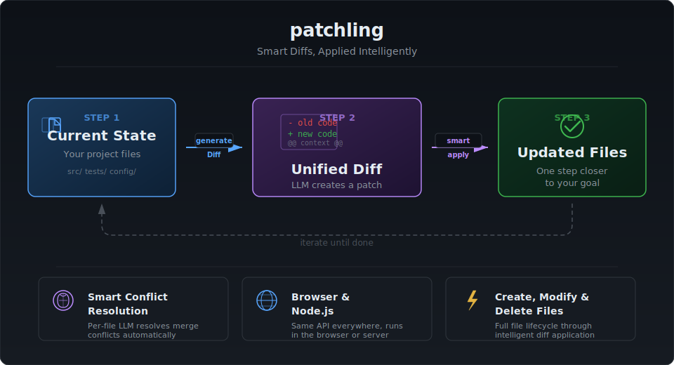

# gptdiff-js

<p align="center">
  
</p>

A browser-first JavaScript port of [gptdiff](https://github.com/255BITS/gptdiff), scoped to the two core APIs — **`generateDiff`** and **`smartapply`** — wired to [NanoGPT](https://nano-gpt.com) for LLM completions (including "Sign in with NanoGPT" OAuth PKCE).

Everything runs in the browser (and in Node 18+): no filesystem, no build step, zero runtime dependencies. The diff engine is a faithful port of the Python implementation; it operates on an in-memory `{ path: content }` file map instead of a directory on disk.

See it in action: **[live browser demos →](https://255bits.github.io/gptdiff-js-examples/)** (source in [gptdiff-js-examples](https://github.com/255BITS/gptdiff-js-examples)).

> **The gptdiff family** —
> [**gptdiff**](https://github.com/255BITS/gptdiff) (CLI + Python API) ·
> **gptdiff-js** (you are here) ·
> [**gptdiff-js-examples**](https://github.com/255BITS/gptdiff-js-examples) (live browser demos)

```js
import { generateDiff, smartapply, buildEnvironment } from 'gptdiff-js';

const files = { 'greet.py': 'def greet():\n    print("hello")\n' };

// 1. Ask the model for a unified diff
const diff = await generateDiff(buildEnvironment(files), 'Say goodbye instead of hello');

// 2. Apply it with AI-powered conflict resolution
const updated = await smartapply(diff, files);
console.log(updated['greet.py']);
```

## Install / run

```bash
npm install gptdiff-js
```

```js
import { generateDiff, smartapply } from 'gptdiff-js';
```

**Browser, no build step** — it's zero-dependency ESM, so a CDN import works directly (once the package is published to npm):

```js
import { generateDiff, smartapply } from 'https://esm.sh/gptdiff-js';
```

**Run from source** — point an import at `src/index.js`, or open `index.html` from a static server:

```bash
npx serve .        # then visit the printed URL and try the demo
npm test           # run the unit suite (Node's built-in test runner)
npm run test:live  # hit NanoGPT for real (requires env vars, see below)
```

## Configuration

Configuration comes from environment variables (Node) or `setEnv(...)` overrides (browser). OAuth sign-in sets the API key override for you.

| Variable | Purpose | Default |
| --- | --- | --- |
| `GPTDIFF_LLM_API_KEY` | NanoGPT API key (`sk-nano-…`) | — (required for live calls) |
| `GPTDIFF_LLM_BASE_URL` | OpenAI-compatible base URL | `https://nano-gpt.com/api/v1/` |
| `GPTDIFF_MODEL` | Model id | `xiaomi/mimo-v2.5-pro-ultraspeed` |

```js
import { setEnv } from 'gptdiff-js';
setEnv('GPTDIFF_LLM_API_KEY', 'sk-nano-…'); // browser, no process.env
```

## Sign in with NanoGPT (OAuth 2.0 + PKCE)

`src/oauth.js` implements the [NanoGPT OAuth PKCE flow](https://nano-gpt.com/blog/sign-in-with-nanogpt-oauth-pkce) using Web Crypto. In a browser:

```js
import { registerClient, beginSignIn, completeSignIn } from 'gptdiff-js/oauth';

// On page load — finishes the redirect and stores the access token as
// the GPTDIFF_LLM_API_KEY override automatically:
await completeSignIn();

// To start sign-in (clientId from a one-time dynamic registration):
const { client_id } = await registerClient({
  clientName: 'My App',
  redirectUri: location.origin + location.pathname,
});
await beginSignIn({ clientId: client_id }); // redirects to NanoGPT
```

Low-level helpers are also exported: `generatePkce`, `buildAuthorizeUrl`, `exchangeCodeForToken`, `generateCodeChallenge`.

## API

### `generateDiff(environment, goal, opts?) → Promise<string>`
Builds the prompt, calls the LLM, and returns the unified diff extracted from the ` ```diff ` block(s) of the response.

- `opts.model`, `opts.temperature`, `opts.maxTokens`, `opts.apiKey`, `opts.baseUrl`, `opts.prepend`, `opts.images`
- `opts.callLlm` — inject a custom/mock completion client (used heavily in tests).

### `smartapply(diffText, files, opts?) → Promise<{ path: content }>`
Applies a diff to an in-memory file map with per-file, LLM-assisted conflict resolution (runs files concurrently). Handles creation, modification, and deletion; `<think>…</think>` and reasoning preambles are stripped automatically. Returns a **new** map; deleted files are omitted.

- `opts.model`, `opts.apiKey`, `opts.baseUrl`, `opts.maxTokens`
- `opts.callLlmForApply` — inject a custom/mock single-file applier.

### `applyDiff(files, diffText) → { changed, files }`
Deterministic, no-LLM patch application (the strict "basic" applier). `changed` is `true` iff something was created, modified, or deleted; `files` is the updated map (equal to the input on failure — no partial writes).

### Other exports
`parseDiffPerFile`, `buildEnvironment`, `colorCodeDiff`, `swallowReasoning`, `stripBadOutput`, `extractDiffBlocks`, `callLlm`, `resolveApiKey`, `resolveBaseUrl`, `getEnv`, `setEnv`, and the `oauth` namespace.

## Differences from the Python package

- **No filesystem.** `applyDiff`/`smartapply` take and return a `{ path: content }` map rather than reading/writing a project directory.
- **Scope.** Only `generateDiff` + `smartapply` (and their dependencies) are ported — not the `gptdiff`/`gptpatch`/`plangptdiff` CLIs.
- **Dependency injection** replaces Python's `monkeypatch`: pass `callLlm` / `callLlmForApply` to test without a network.
- **`fetch` + Web Crypto** replace `openai`/`requests`/`tiktoken`.

## License

MIT
